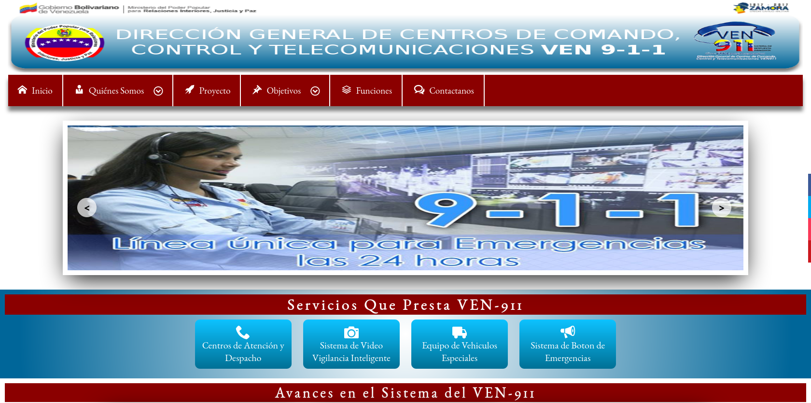

# Pasantias Web VEN9-1-1<picture></picture>

El siguiente repo se realizó como complemento de los estudios de grado en la Pasantía de la carera **Técnico Superior Universitario en Análisis y Diseño de Sistemas**, el cual lleva como título: Diseño de un **Sitio Web Adaptativo** para la difusión y concienciación de información del Centro de Comando, Control y Telecomunicaciones **VEN9-1-1**, el cual cuenta con la siguiente estructura: Inicio, Quienes Somos con (Historia, Misión, Visión), Proyectos, Objetivos con (Generales, Específicos), Funciones, Contactanos. Además, **este cuenta con las siguientes características:**

- [x] Membrete Institucional.
- [x] Menú Pegajoso.
- [x] Slider de Noticias Destacadas.
- [x] Barra Flotante de Redes Sociales.
- [x] Sección de Servicios.
- [X] Últimas Noticias.
- [X] Footer Institucional con Redes Sociales
- [x] Modo responsivo.

##  Lenguajes y Framework Usadas

- HTML5
- CSS3
- JavasScript

##  Herramientas y Tecnologías Usados

- JQuery
- Git

##  Conocimientos Adquiridos

- Lenguaje  de margado [HTML5](https://es.wikipedia.org/wiki/HTML5).
- Lenguaje de estilos [CSS3](https://developer.mozilla.org/es/docs/Web/CSS).
- Lenguaje de programación [JavasCript](https://developer.mozilla.org/es/docs/Web/JavaScript).
- Creación de aplicaciones [Responsive](https://developer.mozilla.org/es/docs/Learn/CSS/CSS_layout/Responsive_Design).
- Uso de librería [JQuery](https://jquery.com/).
- Uso de gestor de versiones [Git](https://git-scm.com/).

##  Referencia

- Libro de [HTML5 y CSS3](https://mega.nz/file/sFZhSI7I#FgMx3O0RNCPUq8qNu-ZYICwcGRmTvYWjboxXvKIK9o0).
- Libro de [CSS3](https://mega.nz/file/gYYDlQJT#0Avsxy2NK-2lROQeEBj-PnaBeJQCAG73NSC6dCT9TH8).
- Libro de [Javascript](https://mega.nz/file/ANZ01RbI#wbaxwGruNXZdbktrHnlh2qDpcMZfxFcX3yheoehddS4).
- Emojis animados de [Animated TeleEmojis](https://telegram-animated-emojis.vercel.app/).
